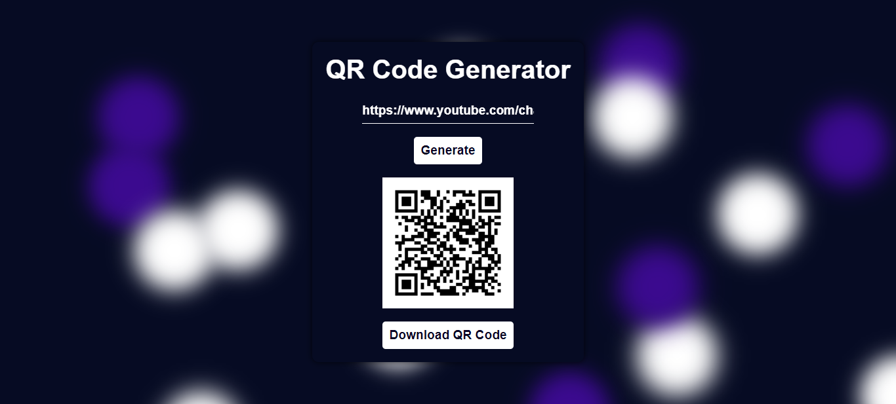

# React QR Generator



> React Application that generates a QR Code and also able to be downloaded as an image

### Built with
- React
- Vite
- QR Code package
- CSS + animation
- Responsive Design
- Vercel for Deployment

**Live demo:** https://fea-qr.vercel.app

Type any text or URL, press **Generate** (or Enter), and the QR code is rendered
in the browser with the [`qrcode`](https://www.npmjs.com/package/qrcode) package.
Nothing is sent to a server.

### Installation
Requires Node.js 12.2+ (verified with Node 24).

```bash
npm install
npm run dev
```

### Scripts
| Command | Description |
| --- | --- |
| `npm run dev` | Start the Vite dev server |
| `npm run build` | Production build into `dist/` |
| `npm run preview` | Serve the production build locally |
